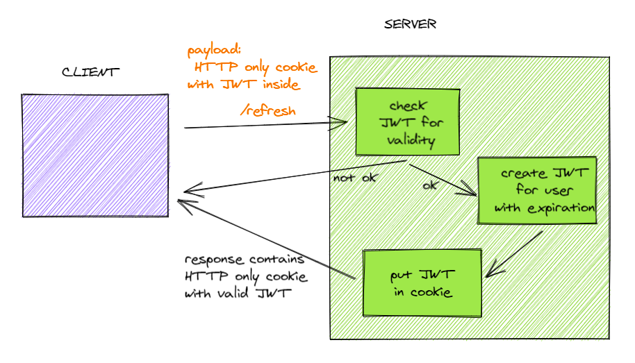

# JWT Authentication with Spring Security and Spring Boot

### Introduction
This is a sample project to demonstrate how to implement JWT Authentication via Cookie with Spring Security and Spring Boot.

